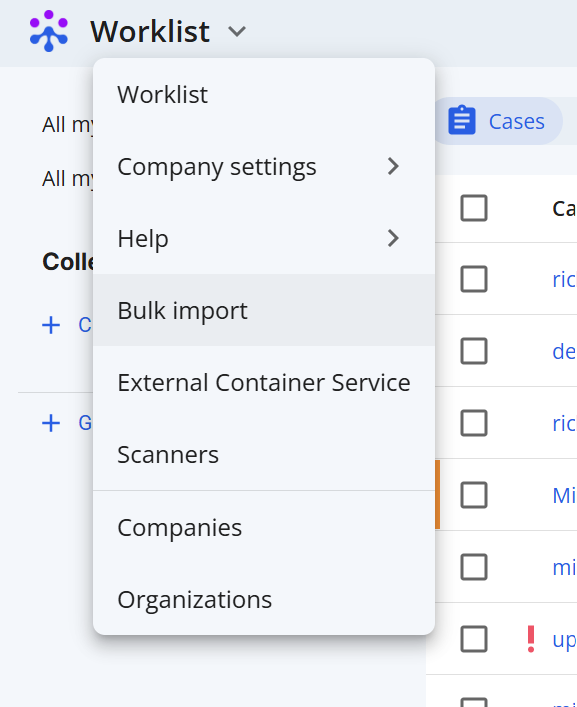

# Techcyte: Bulk Scan Import Tool

## I. Introduction
The Bulk Import Tool is a utility provided to Techcyte users as a way to upload scanned image files. This tool supports DICOM, SVS, and TIFF uploads with optional metadata de-identification. De-identification occurs on the user's machine - no data is uploaded to Techcyte until the final upload page.

## II. Prerequisites
In order to use the Bulk Import Tool you'll need:
- A Techcyte account with appropriate permission (Lab admin OR Lab user)
- The "Bulk import tool" feature flag turned on

## III. Step-by-Step Instructions
We'll need to: select the files you want to upload, optionally redact PHI, keep/remove overview/label images, upload, and assign to a case.

### 1. **Visit the Bulk Import page**
From your worklist view, select Bulk Import from the menu dropdown

### 2. **Select your files**
Click "Select files" or "Select DICOM directory" to select your files. (A test image can be found here: [CMU Openslide Sample](https://openslide.cs.cmu.edu/))  

**NOTE**: Files are modified if you don't select "Direct Upload"

### 3. **View loaded files**

Your image file should show in the list with a thumbnail. Click next to review metadata

### 4. **Review the metadata for any PHI**
Some fields are critical for maintaining file integrity and are turned off by default. Click **Auto redact** to remove all fields that are unnecessary. Click **Next** at the bottom of the page.

### 5. **Verify the images** 
From this page you can review and omit label/overview images contained in the file. By default, SVS label and overview are removed when converting to TIFF redaction and uploading.

### 6. **Review your upload**
Review your file tags/images before uploading, download redacted files, and remove files from upload candidates. Click **Finalize** when ready.

### 7. **Upload**
Click **Start upload** and wait for the upload to complete.

### 8. **Review your upload**
Click the link icon next to your image to review your scan.

### 9. **Correct any issues with the scan** 
If your file's MPP could not automatically be determined, review your scan details and enter it on the **Regions** tab. Click **reprocess** and **Save**

### 10. **Assign to a case**
At the top of the page click "scan details page". From this page, select "Search for case" and add to your case
(If you don't have one, see [creating a case](../creating-a-case/index.md)).

Alternatively, the scan can be added to your case by visiting your worklist page, and selecting the scans view.

Select your image, click "Link to case", and select your case. 

## IV. Troubleshooting
- **DICOM files with base layers over 2GB** in size may present issues for some browsers when attempting de-identification. Try zipping your file, and selecting "Direct upload" on the first bulk import page. **NOTE**: Do not upload any files containing PHI, verify offline.
- **Disabling thumbnails** will result in faster load times, especially for SVS/TIFF files, verify they contain no pixel PHI.

## V. Conclusion
In a few steps we've uploaded a sample SVS file, and reviewed it on the scans page.

