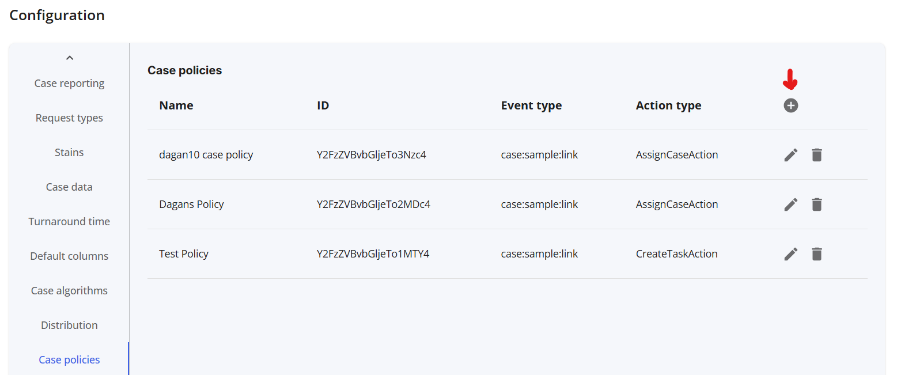
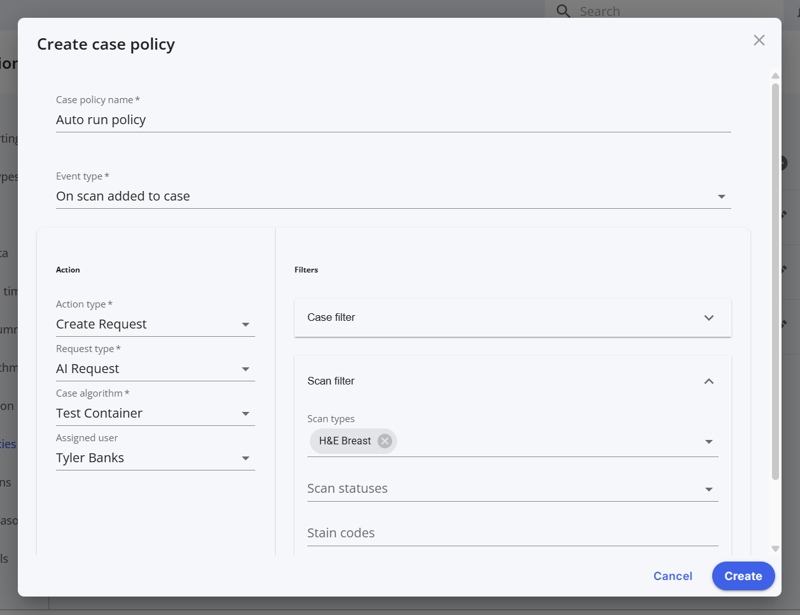

# Creating a case policy

In some cases, you may want to run an AI request automatically, as you import scans for example. By creating a case policy, you can define a set of filters to take an automatic action like starting a docker container.

## I. Step-by-Step Instructions

We'll need to: visit the case policies page, and create the policy.

### 1: Visit the company configuration page

From your worklist view, click the dropdown menu, select Company settings -> configuration 

   

### 2: Create a new case policy

From company configuration, click the case policies tab, then click the plus (+) button to add a new case policy

   

### 3: Configure the policy

Below is an example configuration for starting the `Test Container` when a scan is added to an `H&E Breast` case. Customize to fit your needs.

   
