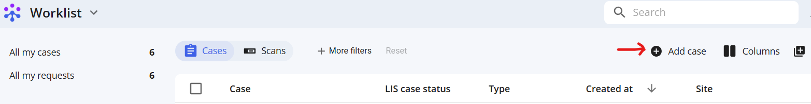
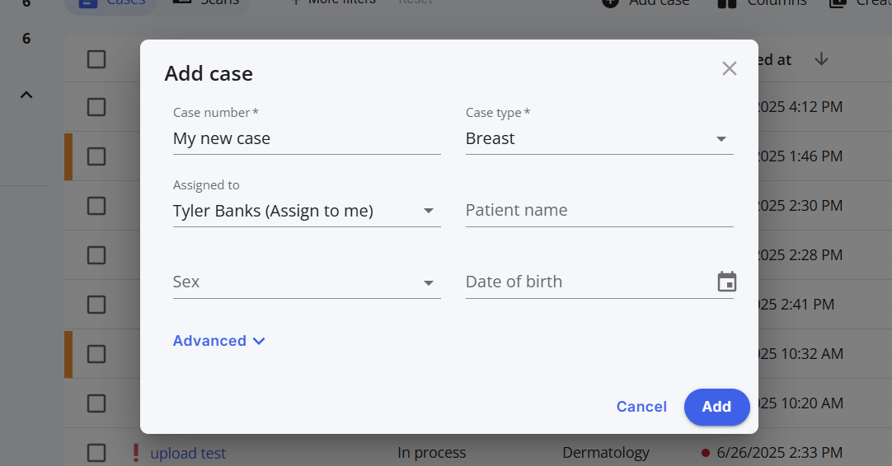
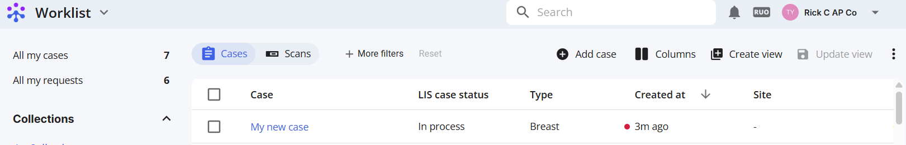
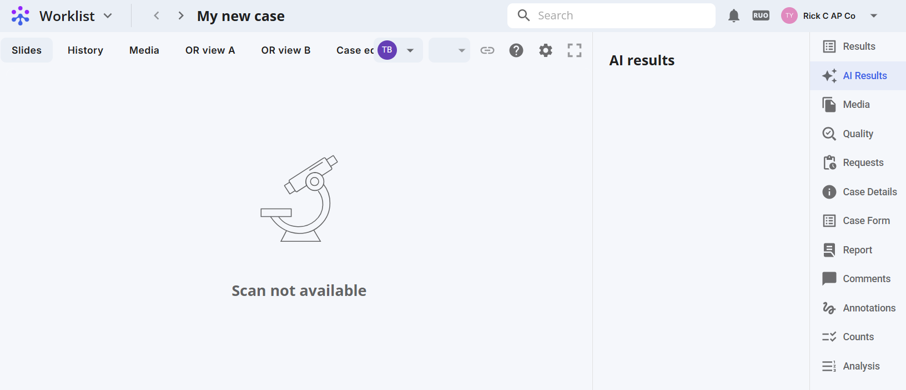

# Creating a case

## I. Step-by-Step Instructions

We'll need to: visit the worklist page, configure a case.

### 1: Visit the worklist page

From your worklist view, click "Add case"  

    

### 2. Configure your case

Name your case, select a case type, and assignee.

    

### 3. View your case

Your case is now available in the worklist menu.

  

Click your case link for the details view.

  

You can now add scans for processing. See the [Bulk Import Tool page](../bulk-import-tool/index.md).