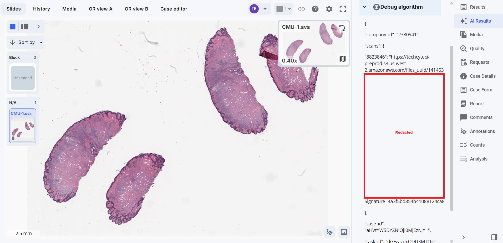

# Creating a debug request

When debugging external bridges and containers you'll need scan ids, task ids, and image urls. By creating debug request you can view these variables and test locally.

## I. Step-by-Step Instructions

We'll need to: visit the case algorithms page, create a new debug algorithm, and create a debug request.

### 1: Visit the company configuration page

From your worklist view, click the dropdown menu, select Company settings -> configuration 

   

### 2: Create a new case algorithm

From company configuration, click the case algorithms tab, then click the plus (+) button to add a new case algorithm

   

### 3: Configure case algorithm

Name the algorithm "Debug" or something similar, set the model type to "External" and leave the webhook url blank. **When the url is blank, webhook calls are skipped and the post request information is added to the task notes.** Create when done.

   

### 4. Return to the worklist

Select your case. If you do not have one see [creating a case](../creating-a-case/index.md)

   

### 5. Create a new AI request

On the image in your case (if you don't have one, use the [bulk scan import tool](../bulk-import-tool/index.md)), right click, select "Create request" -> "AI Request". If you don't see this, see [creating an AI request type](../creating-an-ai-request-type/index.md).

   

### 6. Configure a debug AI request

Select your previously created "Debug algorithm" from the Ai model dropdown, and click "Create request"

  

### 7. Review task details

Your task details (to be used in local requests) will now be available in the AI results panel

  

Example data:

```
{
  "company_id": "2380941",
  "scans": {
    "8823846": "https://techcyteci-preprod.s3.us-west-2.amazonaws.com/files_uuid/1414532c-2954-4673-5e7c-1bbf8b33359b.8061860?X-Amz-Algorithm=AWS4-HMAC-SHA256\u0026X-Amz-Credential=redacted"
  },
  "case_id": "aHVtYW5DYXNlOjI0MjEzNjY=",
  "task_id": "dGFzazoxODU3MTQ=",
  "model_name": ""
}
```

**Note**: The `scans` field is a mapping from `scan_id` to `scan_url`.