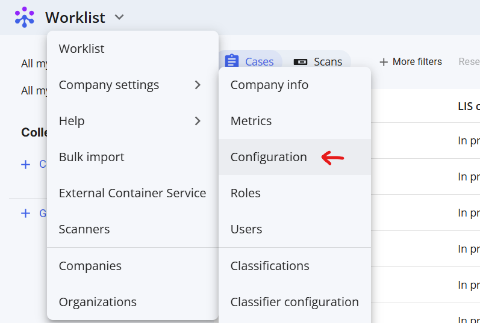
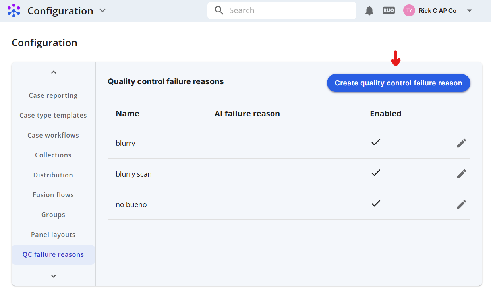
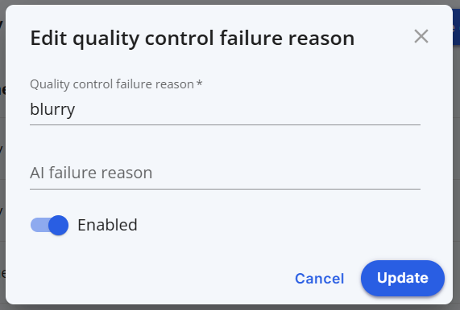
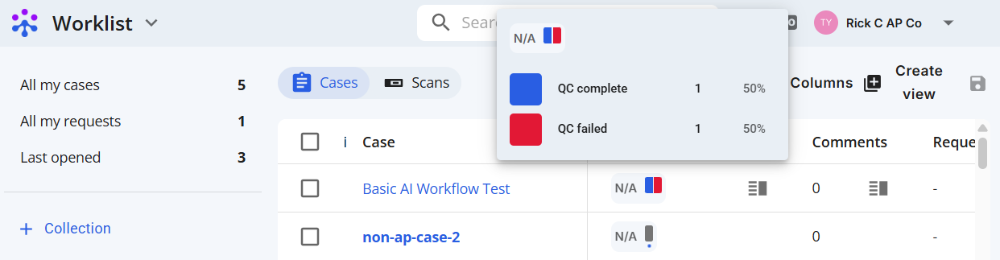
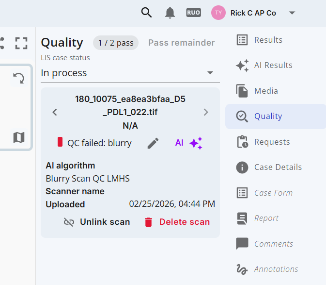

# Creating a Quality Control Failure Reason

In some cases, you may want your model to report quality control failures. By setting up a QC Failure Reason in Fusion and reporting this reason via external results route your scan will be flagged appropriately.

## I. Step-by-Step Instructions

We'll need to: visit the quality control faiure reasons page, create the reason, and report.

### 1: Visit the company configuration page

From your worklist view, click the dropdown menu, select Company settings -> configuration 

   

### 2: Create a new quality control failure reason

From company configuration, click the "QC failure reasons" tab, then click the (Create quality control failure reason) button to add a new reason.

   

### 3: Configure the reason

Below is an example configuration for "blurry" being the fail reason. Customize to fit your needs.

   

### 4: Reporting in external results route

Scans can now be flagged for this reason by supplying a `qcFailReasons` key in the `scanResults`. See [posting external model results](../posting-external-model-results/index.md) for full details and examples.

```
{
    "caseResults": {},
    "scanResults": [
      {
      "scanId": scan_id, 
      "qcFailReasons": ["blurry"]
      }
    ]
}
```

### 5: Viewing in Fusion

Posted QC results are viewable in the worklist view

 


and details can be viewed in the scan view via the Quality tab.

 