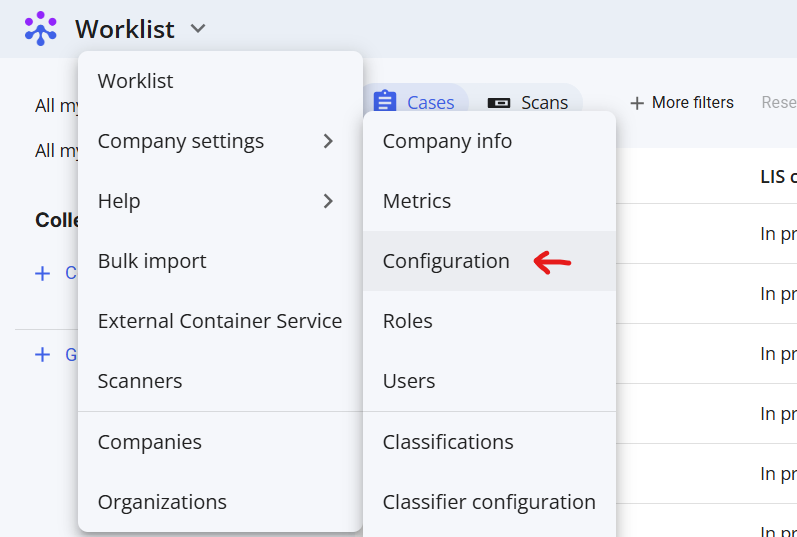
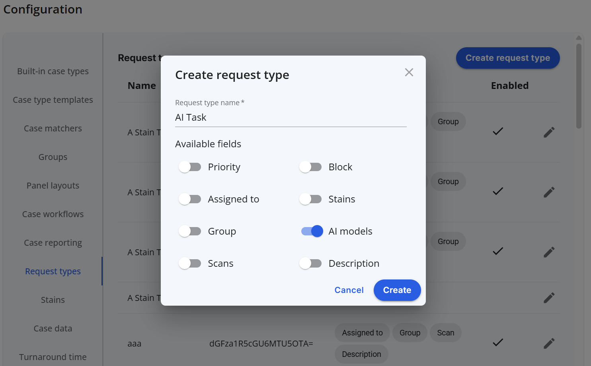

# Creating an AI Task Type

## I. Step-by-Step Instructions

We'll need to: visit the worklist page, configure a case.

### 1: Visit the worklist page

From your worklist view, click the dropdown menu, select Company settings -> configuration 

    

### 2. Configure your task type

In the Request Types tab, click "Create request type", and configure as shown below.

  