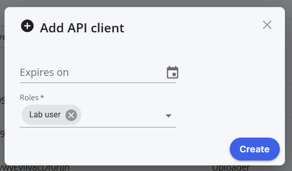

# Creating an API key

When making requests to the Techcyte api, you'll need an API key id and secret. Follow these steps to create your own.

## I. Step-by-Step Instructions

We'll need to: visit the company page, configure a case.

### 1: Visit the worklist page

From your worklist view, click the dropdown menu, select Company settings -> Company info 

    

### 2. Create a new API client

In the API Clients section, click "Add API client".

  

### 3. Configure the API client

Configure and create. To report results and complete a task you must have `Lab Admin` or `Lab User` permission.

  

### 4. Copy your API client credentials

Store your credentials in a safe place.

  