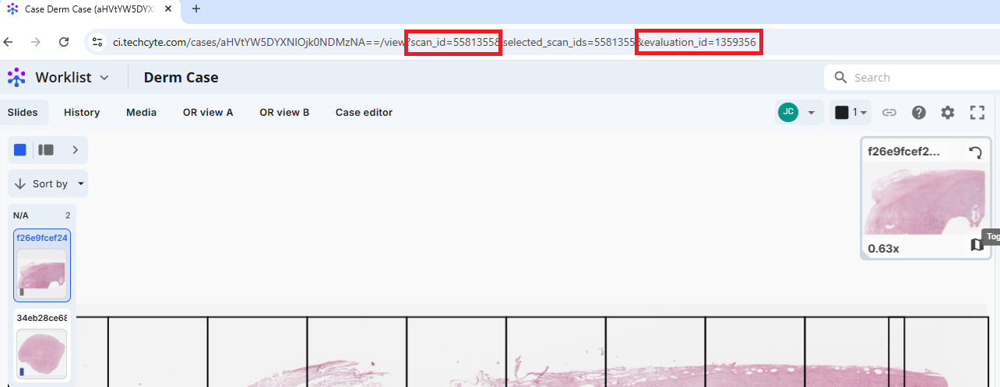

# Downloading objects (example script)

For debugging, it is possible to download all objects from a given evaluation.

## I. Step-by-Step Instructions

We'll need to: collect the scan and evaluation id, generate API credentials, run the example script.

### 1: Visit the evaluation

Collect the `scan_id` and `evaluation_id` from your scan. 

   

### 2: Generate API credentials.

See [creating an api key](../creating-an-api-key/index.md). You will need `viewer` permission.

### 3: Run the example script

Download the devkit.

```
git clone https://github.com/Techcyte/devkit.git
cd devkit/src/download-objects
```

Run the script with your api credentials as environment variables and arguments.

```
CLIENT_ID=<your_client_id> CLIENT_SECRET=<your_client_secret> python ./get_objects.py --scan_id <your_scan_id> --evaluation_id <your_evaluation_id> --save_location ./objects.json
```
