# Techcyte: External Container Service

## I. Introduction

The External Container Service (ECS) is a standalone product designed to provide GPU-based batch processing for Techcyte users. Using their existing Docker tools, users can easily upload their container image to Techcyte and configure them as custom classifiers on the Techcyte platform.

## II. Prerequisites

In order to use the ECS you'll need:

1. A Techcyte account with appropriate permission (Lab Admin, etc.)  
2. The experimental company "External Container Service" feature flag turned on

## III. Step-by-Step Instructions

We'll need to: upload your Docker image, define a runnable container type, configure a case algorithm to use the container, and run a task on your slide.

### 1: Upload your Docker image

* **Visit the External Container Service page**: From your worklist view, select the External Container Service from the menu dropdown  
  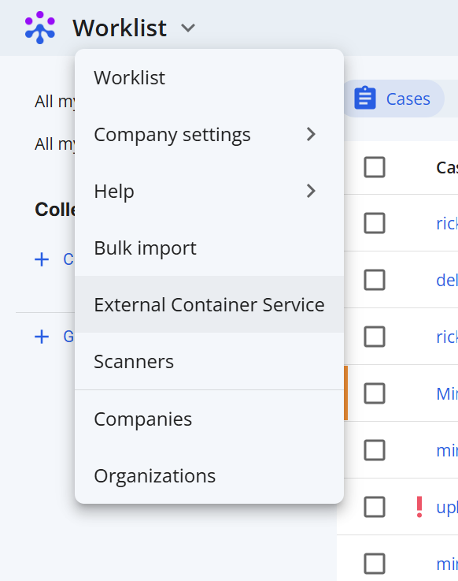  
* **Create an image definition:** Select the "Docker Images" tab  
  
* **Click Create Image**  
  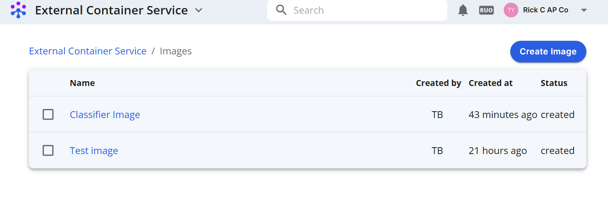
* **Name your image and click "Create"**  
  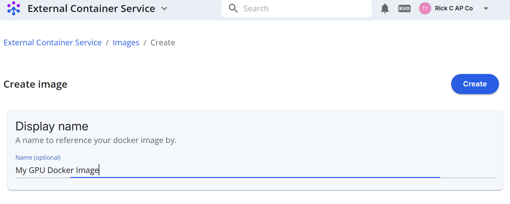

* **Upload your Docker image:** From the command line, in the directory containing your Dockerfile, scripts (example files in VI. Additional Resources, below), execute the four commands shown in the "Docker Push Instructions" modal. Use the "Copy to clipboard" button for long commands. Uploading may take several minutes.  
  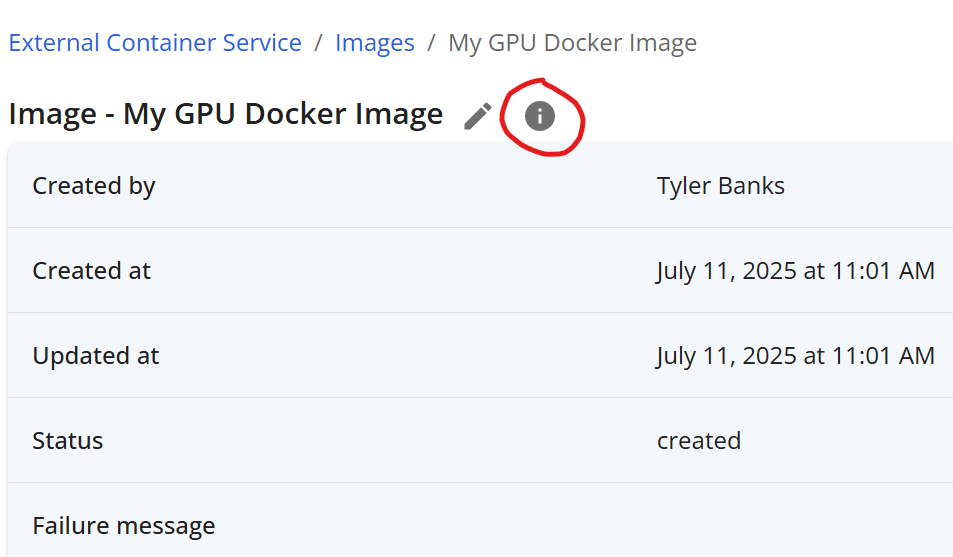
  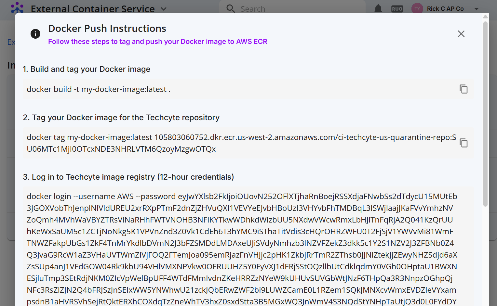  
  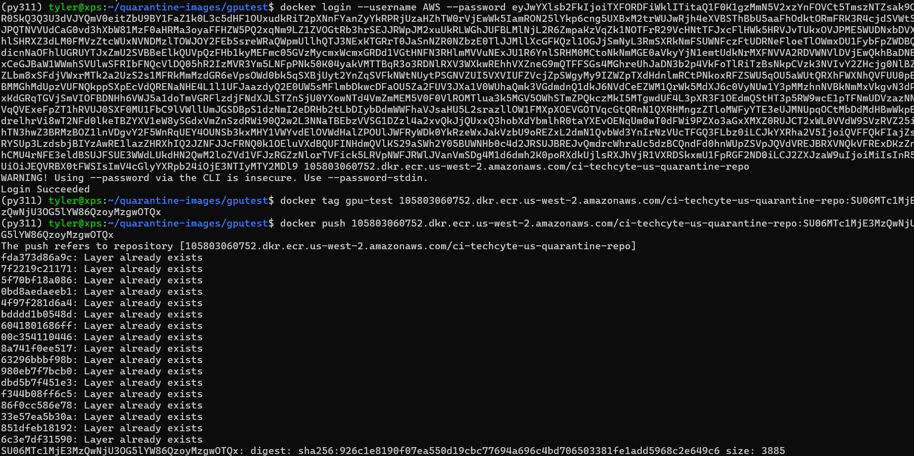

### 2: Create a runnable container

* **Visit the Runnable Containers page**.  
  
* **Click "Create Container"**  
  
* **Configure your container:** Set the name, select your image, and AWS runtime instance type. Additional configuration options will be available at a later date (environment vars).  
  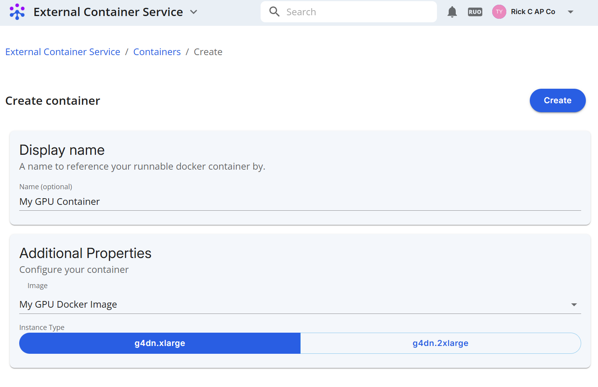

### 3: Setup a Case algorithm for your container

From here, we'll need to configure your cases to use your newly created runnable container.

* **Visit your Company Configuration page:** From the menu dropdown select "Company settings" \-\> "Configuration"  
  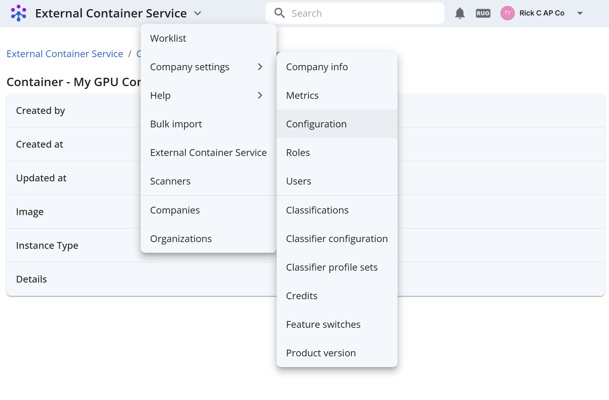
* **Create a new Case algorithm:** Click the \+ icon at the top right  
  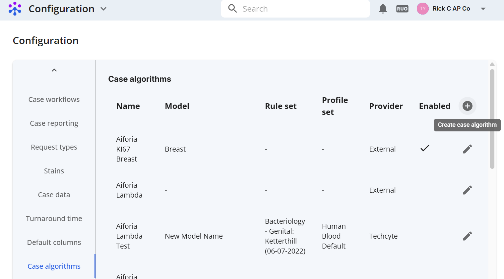
  

* **Configure the case algorithm:** Name your algorithm, select "Container" as the Model provider, and select your container.  
  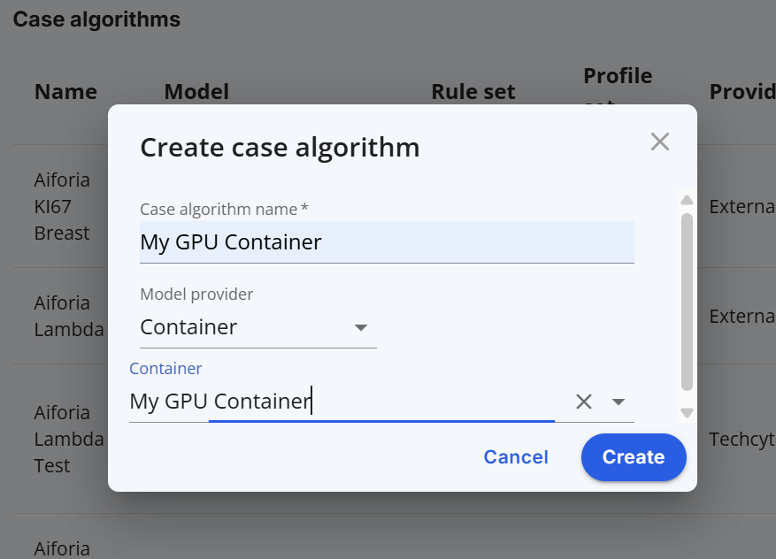

### 4: Run an AI Request on your slide

* **Create an AI Request:** From the case view, right click on your scanned image and select "AI Task" or "AI Request" 
  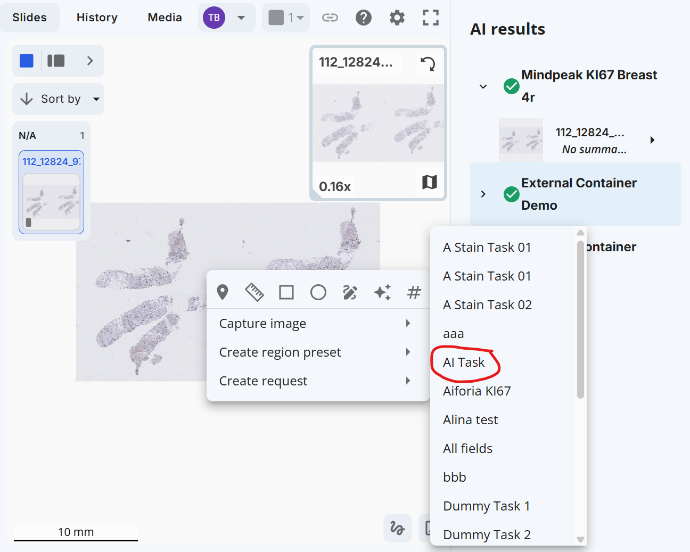
  NOTE: If an "AI models" request type is not available, you'll need to create one, see [Creating an AI request type](../creating-an-ai-request-type/index.md)
* Submit the request: From the Create request \-\> AI Task dialog, select your Case algorithm (My GPU Container here) as the AI model and create the request  
  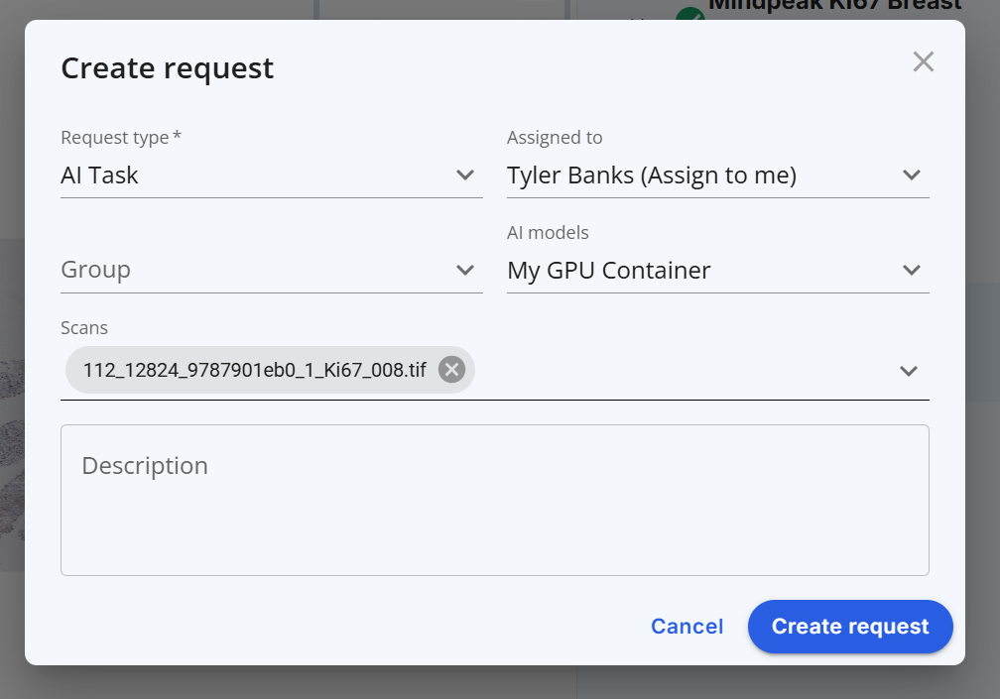

At this point your container will start up, and begin processing the image as you have configured it.

## IV. Troubleshooting

Logs (in development) will be viewable from the "Jobs and Logs" tab on the External Container Service page.  

## V. Conclusion

In a few steps we've uploaded a Docker image, created a runnable container type, defined a case algorithm to use the container, and run an AI task on an uploaded scan. The External Container Service is in active development so new features will be added over time. Images may not be up to date.