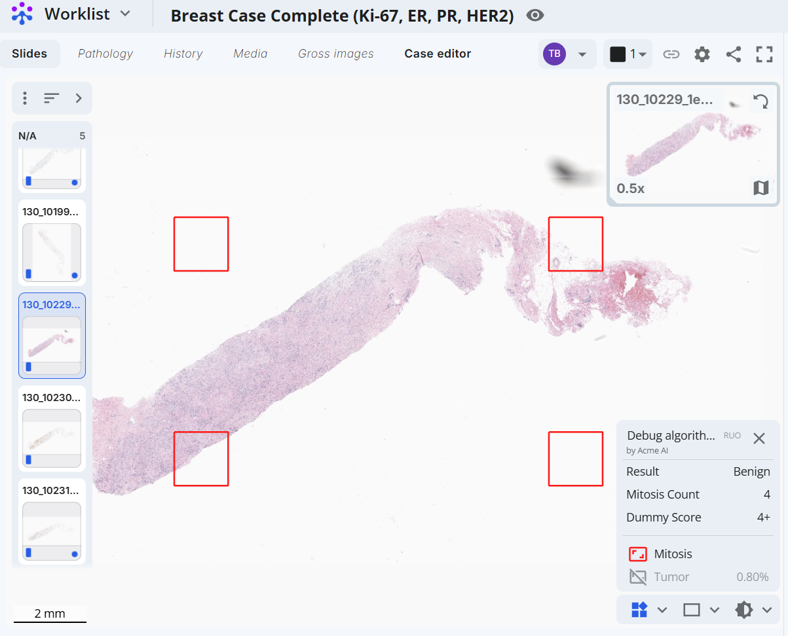

# Posting Results from an External Model

Some requests can trigger a 3rd party AI model to analyze scans.
That 3rd party will then be able to post the results of the analysis.
The REST endpoint where those results may be posted is documented in the [Techcyte Swagger docs](https://api.ci.techcyte.com/docs/#/External%20Results).

## Results Schema

### Request Body

| Key | Description | Type |
| --- | --- | --- |
| caseResults | Free form results for all scans in the request. Use if there are high level, cross scan results found by the model. | object |
| scanResults | Array of results for each scan in the request | array of objects (ScanResult) |

#### ScanResult object

| Key | Description | Type |
| --- | --- | --- |
| scanId | id of scan | string |
| workflow | Object representation of results of full AI workflow | AiWorkflow |
| results | Free form high level results for the scan. Use if there are high level results for the scan. | object |
| geojson | Feature collection containing annotations found on the scan | object (GeoJSON feature collection) |

The `results` object has two special keys: `external_url` and `summary`, both are required to be strings.
If `external_url` is set, then the Techcte UI will create a clickable link to the provided url when displaying the scan results.
The `summary` for each scan will be displayed at a top level alongside the scans in the ai results panel.
All other keys will be displayed when viewing algorithm details for each scan.

______________________________________________________________________

#### AiWorkflow object

| Key | Description | Type |
| --- | --- | --- |
| model_name | Name of the model | string |
| provider | Name of the model provider | string |
| ruo | Indicate if the model is for research use only | bool |
| report | Workflow data, must be one of the available workflow data types | WorkflowData |

#### WorkflowData types

Currently Techcyte support several different workflow data types: Basic Annotation+Data, Whole Slide Differential, Area Differential and Semi-Quantitative Differential.
Each of these types has a `type` key to identify which type is being used and how to marshal and unmarshal the data.

##### Basic Annotation + Data
| Key | Description | Type |
| --- | --- | --- |
| type             | Fixed string identifying the workflow data type                             | "Basic"                                                              |
| results          | List of named key-value result pairs (e.g., diagnosis, scores, counts)      | array of objects `{name: string, result: string}`                    |
| segments         | List of named segments/regions with optional text result and GeoJSON annotations (e.g., tumor region, grade zone, mitosis locations) | array of objects `{name: string, result?: string, feature_collection: GeoJSON FeatureCollection}` |

##### Whole Slide Differential

| Key | Description | Type |
| --- | --- | --- |
| type | fixed string | "WholeSlideDifferential" |
| points | cells or objects found by the model | array of point objects {x: number, y: number, score: number, type: string} |
| scores | map of score names to score values | map from string to number |
| positivity_threshold | threshold for a given point to be considered positive | number |

##### Area Differential

| Key | Description | Type |
| --- | --- | --- |
| type | fixed string | "AreaDifferential" |
| regions | Areas considered in the workflow and the cells or objects found in them | array of DifferentialRegion objects |
| scores | map of score names to score values | map from string to number |
| positivity_threshold | threshold for a given point to be considered positive | number |

###### Differential Region

This object only exists under the `regions` key of the Area Differential type.

| Key | Description | Type |
| --- | --- | --- |
| region | GeoJSON feature with a polygon geometry | GeoJSON feature |
| weight | weight given to this region in score calculation | number |
| score | region score | number |
| points | cells or objects found in the region | array of points {x: number, y: number, score: number, type: string} |

##### Semi-Quantitative Differential

| Key | Description | Type |
| --- | --- | --- |
| type | fixed string | "SemiQuantitativeDifferential" |
| points | cells or objects found by the model | array of point objects {x: number, y: number, type: string} |
| scores | map of score names to score values | map from string to number |

______________________________________________________________________

#### AI Workflow Recipes

Each AI workflow maps to a unique widget displayed in Fusion. Examples added below contain json data posted to the external model results endpoint and the resulting frontend widget displayed.

##### Basic Annotation + Data

Display image annotations and key value data pairs, with the ability to toggle individual classes on and off.

 

```
{
  "caseResults": {},
  "scanResults": [
    {
      "scanId": "8946136",
      "workflow": {
        "model_name": "Mitosis Detection Model",
        "provider": "Acme AI",
        "ruo": "True",
        "report": {
          "type": "Basic",
          "results": [
            {
              "name": "Result",
              "result": "Benign"
            },
            {
              "name": "Mitosis Count",
              "result": "4"
            },
            {
              "name": "Dummy Score",
              "result": "4+"
            }
          ],
          "segments": [
            {
              "name": "Tumor",
              "result": "Percentage: 0.80%",
              "feature_collection": {
                "type": "FeatureCollection",
                "features": []
              }
            },
            {
              "name": "Mitosis",
              "result": "",
              "feature_collection": {
                "type": "FeatureCollection",
                "features": [
                  {
                    "type": "Feature",
                    "geometry": {
                      "type": "Polygon",
                      "coordinates": [
                        [
                          [16716, 8400],
                          [16716, 13998],
                          [22314, 13998],
                          [22314, 8400],
                          [16716, 8400]
                        ]
                      ]
                    },
                    "properties": {
                      "name": "Mitosis",
                      "color": "#ff0000"
                    }
                  },
                  {
                    "type": "Feature",
                    "geometry": {
                      "type": "Polygon",
                      "coordinates": [
                        [
                          [16716, 30798],
                          [16716, 36396],
                          [22314, 36396],
                          [22314, 30798],
                          [16716, 30798]
                        ]
                      ]
                    },
                    "properties": {
                      "name": "Mitosis",
                      "color": "#ff0000"
                    }
                  },
                  {
                    "type": "Feature",
                    "geometry": {
                      "type": "Polygon",
                      "coordinates": [
                        [
                          [55746, 8400],
                          [55746, 13998],
                          [61344, 13998],
                          [61344, 8400],
                          [55746, 8400]
                        ]
                      ]
                    },
                    "properties": {
                      "name": "Mitosis",
                      "color": "#ff0000"
                    }
                  },
                  {
                    "type": "Feature",
                    "geometry": {
                      "type": "Polygon",
                      "coordinates": [
                        [
                          [55746, 30798],
                          [55746, 36396],
                          [61344, 36396],
                          [61344, 30798],
                          [55746, 30798]
                        ]
                      ]
                    },
                    "properties": {
                      "name": "Mitosis",
                      "color": "#ff0000"
                    }
                  }
                ]
              }
            }
          ]
        }
      }
    }
  ]
}
```

#### GeoJSON

Annotations reported to techcyte will use the GeoJSON standard.
For each scan the client will report a GeoJSON [`FeatureCollection`](https://datatracker.ietf.org/doc/html/rfc7946#section-3.3) that contains all the annotations reported for that scan.
Each reported annotation will be a `Feature` object within the `FeatureCollection`, and each `Feature` must have an `annotation_type` key defined in its `properties` field.

Each GeoJSON feature contains a geometry that can be a one of multiple types.
In the example there is a [`Polygon`](https://datatracker.ietf.org/doc/html/rfc7946#section-3.1.6), a [`MultiPoint`](https://datatracker.ietf.org/doc/html/rfc7946#section-3.1.3) and a [`GeometryCollection`](https://datatracker.ietf.org/doc/html/rfc7946#section-3.1.8).

Heatmaps may be reported as a set of contours in a single Feature with a geometry type of `GeometryCollection`.
The contours are `Polygon` geometries and their color is specified with the `contour_colors` key in the properties map of the `GeometryCollection`.
The `countour_colors` is an array of color hex strings.

See more information about the GeoJSON standard on the [GeoJSON format standard website](https://datatracker.ietf.org/doc/html/rfc7946).

## Additional Examples

The following example uses the geojson key to upload objects onto the scan.

```json
{
  "caseResults": {
    "mitosis_count": 1000
  },
  "scanResults": [
    {
      "scanId": "T1J4hvqyD4",
      "results": {
        "mitosis_count": 550,
        "ki67score": .55,
        "external_url": "https://fake.my-app.com/results/for/this/scan",
        "summary": "this is my summary"
      },
      "geojson": {
        "type": "FeatureCollection",
        "features": [
          {
            "type": "Feature",
            "bbox": [ 250, 100, 300, 200 ],
            "geometry": {
              "type": "Polygon",
              "coordinates": [
                [
                  [ 250, 100 ],
                  [ 250, 200 ],
                  [ 300, 250 ],
                  [ 300, 100 ],
                  [ 250, 100 ]
                ]
              ]
            },
            "properties": {
              "annotation_type": "tumor"
            }
          },
          {
            "type": "Feature",
            "properties": {
              "annotation_type": "tumor_confidence",
              "contour_colors": [
                "#AA0000",
                "#CC0000",
                "#FF0000"
              ]
            },
            "geometry": {
              "type": "GeometryCollection",
              "geometries": [
                {
                  "type": "Polygon",
                  "coordinates": [
                    [
                      [ 1, 2 ],
                      [ 3, 2 ],
                      [ 3, 5 ],
                      [ 1, 5 ],
                      [ 1, 2 ]
                    ]
                  ]
                },
                {
                  "type": "Polygon",
                  "coordinates": [
                    [
                      [ 1, 2 ],
                      [ 3, 2 ],
                      [ 3, 5 ],
                      [ 1, 5 ],
                      [ 1, 2 ]
                    ]
                  ]
                },
                {
                  "type": "Polygon",
                  "coordinates": [
                    [
                      [ 1, 2 ],
                      [ 3, 2 ],
                      [ 3, 5 ],
                      [ 1, 5 ],
                      [ 1, 2 ]
                    ]
                  ]
                }
              ]
            }
          }
        ]
      }
    },
    {
      "scanId": "T1J4hvqyD5",
      "results": {
        "mitosis_count": 450
      },
      "geojson": {
        "type": "FeatureCollection",
        "features": [
          {
            "type": "Feature",
            "geometry": {
              "type": "MultiPoint",
              "coordinates": [
                [ 80, 50 ],
                [ 90, 49 ],
                [ 60, 30 ]
              ]
            },
            "properties": {
              "annotation_type": "mitosis_count"
            }
          }
        ]
      }
    }
  ]
}
```

______________________________________________________________________

This example uploads a workflow to the scan

```json
{
  "scanResults": [
    {
      "scanId": "T1J4hvqyD4",
      "workflow": {
        "key": "Proliferation Score",
        "model_name": "KI67 Breast-4R",
        "provider": "Mindpeak",
        "ruo": true,
        "report": {
          "type": "AreaDifferential",
          "scores": {
            "positivity_threshold": 0.4376593987751759,
            "proliferation_score": 0.13330553429026412
          },
          "regions": [
            {
              "score": 0.2150000035762787,
              "weight": 0.05,
              "region": {
                "bbox": [ 11512, 41252, 13048, 42850 ],
                "geometry": {
                  "coordinates": [ [ [ 13048, 41942 ], [ 13040, 42042 ], [ 12986, 42316 ], [ 12960, 42404 ], [ 12872, 42560 ], [ 12830, 42610 ], [ 12678, 42726 ], [ 12658, 42736 ], [ 12632, 42748 ], [ 12320, 42846 ], [ 12150, 42850 ], [ 12048, 42850 ], [ 11590, 42568 ], [ 11568, 42544 ], [ 11522, 42414 ], [ 11512, 41664 ], [ 11526, 41632 ], [ 11610, 41510 ], [ 11728, 41396 ], [ 11842, 41318 ], [ 11888, 41296 ], [ 11938, 41282 ], [ 12408, 41252 ], [ 12790, 41476 ], [ 12852, 41526 ], [ 12878, 41556 ], [ 12944, 41644 ], [ 12984, 41722 ], [ 13020, 41824 ], [ 13044, 41912 ] ] ],
                  "type": "Polygon"
                },
                "properties": {
                  "annotation_type": "region",
                  "name": "Region A"
                },
                "type": "Feature"
              },
              "points": [
                {
                  "score": 0.32819,
                  "type": "tumor",
                  "x": 13042,
                  "y": 41972
                },
                {
                  "score": 0.33399,
                  "type": "tumor",
                  "x": 13030,
                  "y": 41884
                },
                {
                  "score": 0.32082,
                  "type": "tumor",
                  "x": 11938,
                  "y": 41282
                },
                {
                  "score": 0.63977,
                  "type": "tumor",
                  "x": 13044,
                  "y": 41912
                }
              ]
            },
            {
              "score": 0.15299999713897705,
              "weight": 0.16,
              "region": {
                "bbox": [ 34664, 16392, 36298, 17894 ],
                "geometry": {
                  "coordinates": [ [ [ 36298, 16998 ], [ 36284, 17064 ], [ 36276, 17094 ], [ 36108, 17504 ], [ 36052, 17570 ], [ 35528, 17812 ], [ 35452, 17830 ], [ 35076, 17894 ], [ 34880, 17806 ], [ 34824, 17764 ], [ 34802, 17742 ], [ 34696, 17574 ], [ 34664, 17322 ], [ 34682, 17272 ], [ 34710, 17196 ], [ 34774, 17080 ], [ 34800, 17050 ], [ 34908, 16934 ], [ 35450, 16482 ], [ 35612, 16434 ], [ 35926, 16392 ], [ 36148, 16532 ], [ 36270, 16706 ], [ 36296, 16830 ] ] ],
                  "type": "Polygon"
                },
                "properties": {
                  "annotation_type": "region",
                  "name": "Region B"
                },
                "type": "Feature"
              },
              "points": [
                {
                  "score": 0.48057,
                  "type": "tumor",
                  "x": 34880,
                  "y": 17806
                },
                {
                  "score": 0.31419,
                  "type": "tumor",
                  "x": 36296,
                  "y": 16830
                },
                {
                  "score": 0.31906,
                  "type": "tumor",
                  "x": 36052,
                  "y": 17570
                },
                {
                  "score": 0.51786,
                  "type": "tumor",
                  "x": 36298,
                  "y": 16998
                },
                {
                  "score": 0.31818,
                  "type": "tumor",
                  "x": 36108,
                  "y": 17504
                }
              ]
            }
          ]
        }
      }
    }
  ]
}
```
