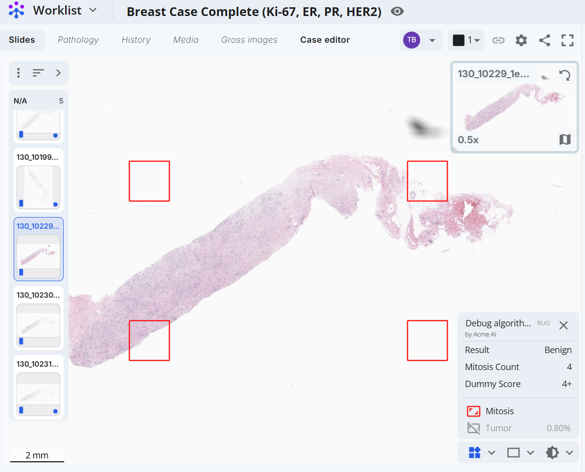

# Posting Results from an External Model

Some requests can trigger a 3rd party AI model to analyze scans.
That 3rd party will then be able to post the results of the analysis.
The REST endpoint where those results may be posted is documented in the [Techcyte Swagger docs](https://api.ci.techcyte.com/docs/#/External%20Results).

## Results Schema

### Request Body

| Key | Description | Type |
| --- | --- | --- |
| scanResults | Array of results for each scan in the request | array of objects (ScanResult) |

#### ScanResult object

| Key | Description | Type |
| --- | --- | --- |
| scanId | id of scan, as a numeric string. The scan must be one of the scans associated with the task. | string |
| workflow | Object representation of results of full AI workflow | object (AiWorkflow) |
| results | Free form high level results for the scan. Use if there are high level results for the scan. | object |
| geojson | Feature collection containing annotations found on the scan | object (GeoJSON FeatureCollection) |
| qcFailReasons | Array of quality control (qc) failure reasons for the scan | array of strings, eg: `["blurry"]` |

The `results` object has two special keys, `external_url` and `summary`. Both are optional:

- `external_url` must be a string. If it is a string, it is lifted out of `results` and stored separately, and the Techcyte UI will create a clickable link to the provided url when displaying the scan results. If it is present but is not a string, it is left in `results` and treated as an ordinary key.
- `summary` must be a string if it is present at all — a non-string `summary` rejects the request. The `summary` for each scan will be displayed at a top level alongside the scans in the ai results panel.

All other keys will be displayed when viewing algorithm details for each scan.

`qcFailReasons` behaves differently depending on whether it is omitted:

- Omitting the key (or sending `null`) leaves the scan's existing QC state untouched.
- Sending `[]` explicitly records a QC pass and sets the scan to passing.
- Reasons that match a label [configured in your company](../creating-a-qc-fail-reason/index.md) are recorded against that reason. Reasons that do not match are **not** rejected — they are recorded as free-text "other" reasons.

______________________________________________________________________

#### AiWorkflow object

| Key | Description | Type |
| --- | --- | --- |
| model_name | Name of the model | string |
| provider | Name of the model provider | string |
| ruo | Indicate if the model is for research use only | bool |
| key | Optional label for the headline value of the workflow (eg: `"Proliferation Score"`) | string |
| value | Optional headline value paired with `key` | string |
| report | Workflow data, must be one of the available workflow report types | object (WorkflowReport) |

______________________________________________________________________

## Behavior and Constraints

Things worth knowing before you post results:

**The `task_id` path parameter** accepts either a plain integer or the base64 key/value encoded task id.

**A POST is all or nothing.** The entire request is processed in a single transaction. If any scan in `scanResults` fails schema validation, nothing from the request is written — including results for scans that were themselves valid.

**Posting completes the task.** Each scan in the request is marked complete once its results are written, so a POST is effectively final. Results are also *appended*, not upserted: posting twice for the same scan creates two evaluations rather than replacing the first.

**Each scan must have exactly one region.** Scans with zero regions or more than one region are rejected.

**An unrecognized `report.type` rejects the whole request.** The report is parsed by its `type` discriminator, so a typo there fails every scan in the request, not just the one workflow.

**Bounding boxes come from `bbox` or a `Polygon` geometry.** For each feature in the top-level `geojson`, the stored bounding box is taken from a 4-element `bbox` if present, otherwise computed from the geometry if it is a `Polygon`. Other geometry types — including `MultiPoint` and `GeometryCollection` — get a zero bounding box unless you supply an explicit `bbox`. Supply one for heatmap contours and point sets.

**Responses.** `POST /external/results/{task_id}` returns `201 Created` with a null body. `PATCH /external/case/{task_id}` returns `204 No Content`.

______________________________________________________________________

## Workflow Report Types

Each report object has a `type` key that identifies which report type is being used and determines how the rest of the object is parsed.
Each type maps to a unique widget displayed in Fusion.
The sections below give the schema for each type along with an example request body.

| `type` value | Description |
| --- | --- |
| [`Basic`](#basic) | Key-value results plus named annotation segments |
| [`WholeSlideDifferential`](#whole-slide-differential) | Scored points across the whole slide |
| [`AreaDifferential`](#area-differential) | Scored points grouped into weighted regions |
| [`SemiQuantitativeDifferential`](#semi-quantitative-differential) | Unscored points across the whole slide |
| [`RegionCounting`](#region-counting) | Bounding-box objects counted within regions |
| [`AiMitosisCounting`](#ai-mitosis-counting) | Same shape as `RegionCounting`, scoped to mitosis counting |
| [`TumorCellularity`](#tumor-cellularity) | Tumor cellularity measured at one or more thresholds |

### Basic

Display image annotations and key value data pairs, with the ability to toggle individual classes on and off.

| Key | Description | Type |
| --- | --- | --- |
| type | Fixed string identifying the report type | `"Basic"` |
| results | List of named key-value result pairs (e.g., diagnosis, scores, counts) | array of objects `{name: string, result: string}` |
| segments | List of named segments/regions with an optional text result and GeoJSON annotations (e.g., tumor region, grade zone, mitosis locations) | array of objects `{name: string, result: string, feature_collection: GeoJSON FeatureCollection}` |



```json
{
  "scanResults": [
    {
      "scanId": "8946136",
      "workflow": {
        "model_name": "Mitosis Detection Model",
        "provider": "Acme AI",
        "ruo": true,
        "report": {
          "type": "Basic",
          "results": [
            {
              "name": "Result",
              "result": "Benign"
            },
            {
              "name": "Mitosis Count",
              "result": "4"
            },
            {
              "name": "Dummy Score",
              "result": "4+"
            }
          ],
          "segments": [
            {
              "name": "Tumor",
              "result": "Percentage: 0.80%",
              "feature_collection": {
                "type": "FeatureCollection",
                "features": []
              }
            },
            {
              "name": "Mitosis",
              "result": "",
              "feature_collection": {
                "type": "FeatureCollection",
                "features": [
                  {
                    "type": "Feature",
                    "geometry": {
                      "type": "Polygon",
                      "coordinates": [
                        [
                          [16716, 8400],
                          [16716, 13998],
                          [22314, 13998],
                          [22314, 8400],
                          [16716, 8400]
                        ]
                      ]
                    },
                    "properties": {
                      "name": "Mitosis",
                      "color": "#ff0000"
                    }
                  },
                  {
                    "type": "Feature",
                    "geometry": {
                      "type": "Polygon",
                      "coordinates": [
                        [
                          [55746, 30798],
                          [55746, 36396],
                          [61344, 36396],
                          [61344, 30798],
                          [55746, 30798]
                        ]
                      ]
                    },
                    "properties": {
                      "name": "Mitosis",
                      "color": "#ff0000"
                    }
                  }
                ]
              }
            }
          ]
        }
      }
    }
  ]
}
```

### Whole Slide Differential

| Key | Description | Type |
| --- | --- | --- |
| type | Fixed string identifying the report type | `"WholeSlideDifferential"` |
| points | Cells or objects found by the model | array of objects `{x: number, y: number, score: number, type: string}` |
| scores | Map of score names to score values | map from string to number |
| positivity_threshold | Threshold for a given point to be considered positive | number |

```json
{
  "scanResults": [
    {
      "scanId": "8946136",
      "workflow": {
        "key": "Proliferation Score",
        "model_name": "KI67 Breast-4R",
        "provider": "Mindpeak",
        "ruo": true,
        "report": {
          "type": "WholeSlideDifferential",
          "positivity_threshold": 0.4376593987751759,
          "scores": {
            "proliferation_score": 0.13330553429026412
          },
          "points": [
            { "x": 13042, "y": 41972, "score": 0.32819, "type": "tumor" },
            { "x": 13030, "y": 41884, "score": 0.33399, "type": "tumor" },
            { "x": 11938, "y": 41282, "score": 0.63977, "type": "tumor" }
          ]
        }
      }
    }
  ]
}
```

### Area Differential

| Key | Description | Type |
| --- | --- | --- |
| type | Fixed string identifying the report type | `"AreaDifferential"` |
| regions | Areas considered in the workflow and the cells or objects found in them | array of objects (DifferentialRegion) |
| scores | Map of score names to score values | map from string to number |
| positivity_threshold | Threshold for a given point to be considered positive | number |

#### DifferentialRegion object

This object only exists under the `regions` key of the Area Differential type.

| Key | Description | Type |
| --- | --- | --- |
| region | GeoJSON feature with a polygon geometry | GeoJSON Feature |
| weight | Weight given to this region in score calculation | number |
| score | Region score | number |
| points | Cells or objects found in the region | array of objects `{x: number, y: number, score: number, type: string}` |

```json
{
  "scanResults": [
    {
      "scanId": "8946136",
      "qcFailReasons": [],
      "workflow": {
        "key": "Proliferation Score",
        "model_name": "KI67 Breast-4R",
        "provider": "Mindpeak",
        "ruo": true,
        "report": {
          "type": "AreaDifferential",
          "positivity_threshold": 0.4376593987751759,
          "scores": {
            "proliferation_score": 0.13330553429026412
          },
          "regions": [
            {
              "score": 0.2150000035762787,
              "weight": 0.05,
              "region": {
                "type": "Feature",
                "bbox": [ 11512, 41252, 13048, 42850 ],
                "geometry": {
                  "type": "Polygon",
                  "coordinates": [ [ [ 13048, 41942 ], [ 12960, 42404 ], [ 12658, 42736 ], [ 12048, 42850 ], [ 11512, 41664 ], [ 11728, 41396 ], [ 12408, 41252 ], [ 12944, 41644 ], [ 13048, 41942 ] ] ]
                },
                "properties": {
                  "annotation_type": "region",
                  "name": "Region A"
                }
              },
              "points": [
                { "x": 13042, "y": 41972, "score": 0.32819, "type": "tumor" },
                { "x": 13030, "y": 41884, "score": 0.33399, "type": "tumor" },
                { "x": 11938, "y": 41282, "score": 0.32082, "type": "tumor" },
                { "x": 13044, "y": 41912, "score": 0.63977, "type": "tumor" }
              ]
            },
            {
              "score": 0.15299999713897705,
              "weight": 0.16,
              "region": {
                "type": "Feature",
                "bbox": [ 34664, 16392, 36298, 17894 ],
                "geometry": {
                  "type": "Polygon",
                  "coordinates": [ [ [ 36298, 16998 ], [ 36108, 17504 ], [ 35452, 17830 ], [ 34880, 17806 ], [ 34664, 17322 ], [ 34908, 16934 ], [ 35926, 16392 ], [ 36270, 16706 ], [ 36298, 16998 ] ] ]
                },
                "properties": {
                  "annotation_type": "region",
                  "name": "Region B"
                }
              },
              "points": [
                { "x": 34880, "y": 17806, "score": 0.48057, "type": "tumor" },
                { "x": 36296, "y": 16830, "score": 0.31419, "type": "tumor" },
                { "x": 36052, "y": 17570, "score": 0.31906, "type": "tumor" },
                { "x": 36298, "y": 16998, "score": 0.51786, "type": "tumor" },
                { "x": 36108, "y": 17504, "score": 0.31818, "type": "tumor" }
              ]
            }
          ]
        }
      }
    }
  ]
}
```

### Semi-Quantitative Differential

| Key | Description | Type |
| --- | --- | --- |
| type | Fixed string identifying the report type | `"SemiQuantitativeDifferential"` |
| points | Cells or objects found by the model | array of objects `{x: number, y: number, score: number, type: string}` |
| scores | Map of score names to score values | map from string to number |

```json
{
  "scanResults": [
    {
      "scanId": "8946136",
      "workflow": {
        "model_name": "Semi-Quant Model",
        "provider": "Acme AI",
        "ruo": true,
        "report": {
          "type": "SemiQuantitativeDifferential",
          "scores": {
            "intensity": 2,
            "proportion": 0.35
          },
          "points": [
            { "x": 13042, "y": 41972, "score": 0, "type": "weak" },
            { "x": 13030, "y": 41884, "score": 0, "type": "moderate" },
            { "x": 11938, "y": 41282, "score": 0, "type": "strong" }
          ]
        }
      }
    }
  ]
}
```

### Region Counting

| Key | Description | Type |
| --- | --- | --- |
| type | Fixed string identifying the report type | `"RegionCounting"` |
| objects | Bounding boxes of the objects found by the model | array of objects `{x: number, y: number, width: number, height: number}` |
| regions | Regions the objects are counted within | array of GeoJSON Features |

```json
{
  "scanResults": [
    {
      "scanId": "8946136",
      "workflow": {
        "model_name": "Region Counting Model",
        "provider": "Acme AI",
        "ruo": true,
        "report": {
          "type": "RegionCounting",
          "objects": [
            { "x": 16716, "y": 8400, "width": 64, "height": 64 },
            { "x": 16780, "y": 8460, "width": 64, "height": 64 }
          ],
          "regions": [
            {
              "type": "Feature",
              "geometry": {
                "type": "Polygon",
                "coordinates": [
                  [
                    [16700, 8380],
                    [16700, 8600],
                    [16900, 8600],
                    [16900, 8380],
                    [16700, 8380]
                  ]
                ]
              },
              "properties": {
                "annotation_type": "region",
                "name": "Region A"
              }
            }
          ]
        }
      }
    }
  ]
}
```

### AI Mitosis Counting

Identical in shape to [`RegionCounting`](#region-counting), but reported as a distinct type so mitosis counting results can be identified without picking up other `RegionCounting` workflows.

| Key | Description | Type |
| --- | --- | --- |
| type | Fixed string identifying the report type | `"AiMitosisCounting"` |
| objects | Bounding boxes of the mitotic figures found by the model | array of objects `{x: number, y: number, width: number, height: number}` |
| regions | Regions the mitotic figures are counted within (eg: the hotspot) | array of GeoJSON Features |

```json
{
  "scanResults": [
    {
      "scanId": "8946136",
      "workflow": {
        "model_name": "Mitosis Counting Model",
        "provider": "Acme AI",
        "ruo": true,
        "report": {
          "type": "AiMitosisCounting",
          "objects": [
            { "x": 16716, "y": 8400, "width": 64, "height": 64 },
            { "x": 22314, "y": 13998, "width": 64, "height": 64 }
          ],
          "regions": [
            {
              "type": "Feature",
              "geometry": {
                "type": "Polygon",
                "coordinates": [
                  [
                    [16716, 8400],
                    [16716, 13998],
                    [22314, 13998],
                    [22314, 8400],
                    [16716, 8400]
                  ]
                ]
              },
              "properties": {
                "annotation_type": "region",
                "name": "Hotspot"
              }
            }
          ]
        }
      }
    }
  ]
}
```

### Tumor Cellularity

Reports tumor cellularity for one or more thresholds.
`threshold_map` is keyed by a label for the threshold (eg: `"TC 0.40"`), and each entry describes the region that meets that threshold, its area, the object counts within it, and optional distributions.

| Key | Description | Type |
| --- | --- | --- |
| type | Fixed string identifying the report type | `"TumorCellularity"` |
| threshold_map | Map of threshold label to the result measured at that threshold | map from string to object (ThresholdResult) |

#### ThresholdResult object

| Key | Description | Type |
| --- | --- | --- |
| tumor_cellularity | Tumor cellularity measured for this threshold, as a fraction | number |
| counts | Object counts within the region, by label | array of objects `{label: string, count: number}` |
| region | GeoJSON feature describing the region this threshold applies to | GeoJSON Feature |
| area | Area of the region | number |
| distributions | Optional named distributions across the region. May be omitted or `null`. | map from string to array of objects `{label: string, fraction: number, area: number}` |

```json
{
  "scanResults": [
    {
      "scanId": "8946136",
      "workflow": {
        "model_name": "Tumor Cellularity Model",
        "provider": "Acme AI",
        "ruo": true,
        "report": {
          "type": "TumorCellularity",
          "threshold_map": {
            "TC 0.40": {
              "tumor_cellularity": 0.4,
              "counts": [
                { "label": "cancer", "count": 12000 }
              ],
              "region": {
                "type": "Feature",
                "geometry": {
                  "type": "Polygon",
                  "coordinates": [
                    [
                      [23928, 56064],
                      [23920, 56072],
                      [23904, 56072],
                      [24072, 56064],
                      [23928, 56064]
                    ]
                  ]
                },
                "properties": {
                  "annotation_type": "region"
                }
              },
              "area": 45.5,
              "distributions": {
                "cellularity": [
                  { "label": "0.0 - 0.25", "fraction": 0.1, "area": 4.55 },
                  { "label": "0.25 - 0.5", "fraction": 0.3, "area": 13.65 },
                  { "label": "0.5 - 1.0", "fraction": 0.6, "area": 27.3 }
                ]
              }
            },
            "TC 0.50": {
              "tumor_cellularity": 0.5,
              "counts": [
                { "label": "cancer", "count": 9000 }
              ],
              "region": {
                "type": "Feature",
                "geometry": {
                  "type": "Polygon",
                  "coordinates": [
                    [
                      [23928, 56064],
                      [23920, 56072],
                      [23904, 56072],
                      [24072, 56064],
                      [23928, 56064]
                    ]
                  ]
                },
                "properties": {
                  "annotation_type": "region"
                }
              },
              "area": 30.5,
              "distributions": null
            }
          }
        }
      }
    }
  ]
}
```

______________________________________________________________________

## GeoJSON

Annotations reported to Techcyte will use the GeoJSON standard.
For each scan the client will report a GeoJSON [`FeatureCollection`](https://datatracker.ietf.org/doc/html/rfc7946#section-3.3) that contains all the annotations reported for that scan.
Each reported annotation will be a `Feature` object within the `FeatureCollection`, and each `Feature` must have an `annotation_type` key defined in its `properties` field.
A feature missing `annotation_type`, or whose `annotation_type` is not a string, rejects the whole request.

Each GeoJSON feature contains a geometry that can be one of multiple types.
In the example below there is a [`Polygon`](https://datatracker.ietf.org/doc/html/rfc7946#section-3.1.6), a [`MultiPoint`](https://datatracker.ietf.org/doc/html/rfc7946#section-3.1.3) and a [`GeometryCollection`](https://datatracker.ietf.org/doc/html/rfc7946#section-3.1.8).

Heatmaps may be reported as a set of contours in a single Feature with a geometry type of `GeometryCollection`.
The contours are `Polygon` geometries and their color is specified with the `contour_colors` key in the properties map of the `GeometryCollection`.
The `contour_colors` value is an array of color hex strings.

See more information about the GeoJSON standard on the [GeoJSON format standard website](https://datatracker.ietf.org/doc/html/rfc7946).

The following example uses the `geojson` key to upload objects onto the scan.

```json
{
  "scanResults": [
    {
      "scanId": "8946136",
      "results": {
        "external_url": "https://fake.my-app.com/results/for/this/scan",
        "summary": "this is my summary"
      },
      "qcFailReasons": [],
      "geojson": {
        "type": "FeatureCollection",
        "features": [
          {
            "type": "Feature",
            "bbox": [ 250, 100, 300, 200 ],
            "geometry": {
              "type": "Polygon",
              "coordinates": [
                [
                  [ 250, 100 ],
                  [ 250, 200 ],
                  [ 300, 250 ],
                  [ 300, 100 ],
                  [ 250, 100 ]
                ]
              ]
            },
            "properties": {
              "annotation_type": "tumor"
            }
          },
          {
            "type": "Feature",
            "bbox": [ 1, 2, 5, 7 ],
            "geometry": {
              "type": "GeometryCollection",
              "geometries": [
                {
                  "type": "Polygon",
                  "coordinates": [
                    [
                      [ 1, 2 ],
                      [ 3, 2 ],
                      [ 3, 5 ],
                      [ 1, 5 ],
                      [ 1, 2 ]
                    ]
                  ]
                },
                {
                  "type": "Polygon",
                  "coordinates": [
                    [
                      [ 2, 3 ],
                      [ 4, 3 ],
                      [ 4, 6 ],
                      [ 2, 6 ],
                      [ 2, 3 ]
                    ]
                  ]
                },
                {
                  "type": "Polygon",
                  "coordinates": [
                    [
                      [ 3, 4 ],
                      [ 5, 4 ],
                      [ 5, 7 ],
                      [ 3, 7 ],
                      [ 3, 4 ]
                    ]
                  ]
                }
              ]
            },
            "properties": {
              "annotation_type": "tumor_confidence",
              "contour_colors": [
                "#AA0000",
                "#CC0000",
                "#FF0000"
              ]
            }
          }
        ]
      }
    },
    {
      "scanId": "8946137",
      "geojson": {
        "type": "FeatureCollection",
        "features": [
          {
            "type": "Feature",
            "bbox": [ 60, 30, 90, 50 ],
            "geometry": {
              "type": "MultiPoint",
              "coordinates": [
                [ 80, 50 ],
                [ 90, 49 ],
                [ 60, 30 ]
              ]
            },
            "properties": {
              "annotation_type": "mitosis_count"
            }
          }
        ]
      }
    }
  ]
}
```

______________________________________________________________________

## Reading Case Evaluations

After results have been posted for a task, you can retrieve all evaluations associated with the task's case using the `GET /external/case_evaluations/{task_id}` endpoint.

This requires a task token with read permission on all scan evaluations in the case.

Note that this returns **every** evaluation on the case associated with the given task ID, not only the ones your task posted.
That includes evaluations from other tasks and algorithms as well as human evaluations, so filter on `task_id` if you only want your own.

### Request

```
GET /api/v3/external/case_evaluations/{task_id}
Authorization: Bearer <task_token>
```

### Response

Returns an array of evaluation objects. Each evaluation includes the `details` blob that was stored when results were posted, built from the `results` object of the matching `ScanResult`:

| Key in `details` | Source |
| --- | --- |
| report | The scan's `results` object, minus `external_url` |
| external_url | The scan's `results.external_url`, if it was a string |
| caseReport | The request's `caseResults` object, if one was sent |

The `workflow` object is **not** part of `details`.
Workflow reports are stored separately from the evaluation, so they do not come back on this endpoint — use it for the high level `results` you posted, not for retrieving a workflow report.

```json
[
  {
    "id": 1,
    "sample_id": 42,
    "case_id": 7,
    "task_id": 174590,
    "details": {
      "report": {
        "triage_score": 0.75,
        "summary": "this is my summary"
      },
      "external_url": "https://fake.my-app.com/results/for/this/scan"
    }
  },
  {
    "id": 2,
    "sample_id": 43,
    "case_id": 7,
    "task_id": 174590,
    "details": {
      "report": {
        "triage_score": 0.25
      }
    }
  }
]
```

______________________________________________________________________

## Updating a Case

You can update fields on the case associated with a task using `PATCH /external/case/{task_id}`.

This requires a task token with write permission on the task's case.

### Request Body

Currently supported fields include:

| Key | Description | Type |
| --- | --- | --- |
| triage_category | Triage category label | string |
| triage_score | Numeric triage score | number |

Fields that are omitted are left unchanged, so sending `{}` is accepted and does nothing.
Neither field is validated beyond its type — `triage_score` is stored as given.

### Request

```
PATCH /api/v3/external/case/{task_id}
Authorization: Bearer <task_token>
Content-Type: application/json

{
  "triage_category": "High",
  "triage_score": 0.50
}
```

### Response

```
HTTP/1.1 204 No Content
```
